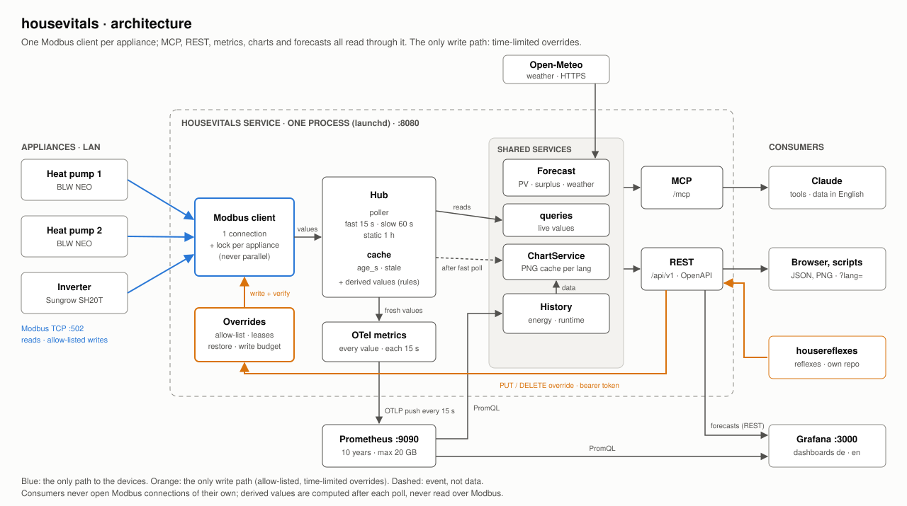

<p align="center">
  
</p>

# housevitals

**housevitals is an open-source telemetry and data access layer for residential vital systems.**

It collects and exposes the vital data of a home — from electricity, PV and battery to heating, water, gas, mobility and environmental conditions — providing a unified view of its ongoing state and resource flows.

This repository (MIT) is the service that implements it. Today it collects telemetry
from heat pumps, PV inverters and batteries, keeps its history, and exposes current and
historical values through standard interfaces: Prometheus, a REST API, MCP (Model
Context Protocol) and charts.

It is a data layer between home hardware and the applications that need its data:
dashboards, scripts, automations and AI assistants read one consistent,
manufacturer-independent representation instead of each integrating every device.

**Supported hardware** (Modbus TCP on the local network):

| Device | Profiles |
|--------|----------|
| Brötje heat pumps | `iwr` (IWR/GTW-08 gateway), `isr` (ISR Plus/MODBM), `neo` (BLW NEO) |
| Sungrow SH hybrid inverters, incl. battery and grid meter | `sungrow_sh` |

Further devices (wallboxes, smart meters, other heat pumps or inverters) can be added
as register profiles; see [Adding your own devices](#adding-your-own-devices) for a
Claude Code prompt that guides you through it. The service reads; it writes to a device only through
[overrides](#control-api-overrides): setpoints you allow-list, within bounds, for a
limited time, restored afterwards. Without an allow-list it never writes.

## Architecture

```text
 Heat pumps, inverter/battery/meter  (Modbus TCP)
                │  ▲
                │  └── Overrides: allow-listed, bounded, time-limited ◄── Control API ◄── automations
                ▼      (same serialized connection, restored afterwards)                (e.g. housereflexes)
 Poller: one serialized connection per device, poll plan fast / slow / static
                │
                ▼
 Cache: latest value per data point, with age and stale flag ──► REST API · MCP (live values)
   + derived values computed by profile rules after each poll (e.g. energy from power)
                │
                ▼  OpenTelemetry SDK, OTLP push every 15 s
 Prometheus: time-series storage (10 years) ─────────────────► Grafana dashboards
                │
                ▼  PromQL
 History, energy balance, runtimes, PNG charts ──────────────► REST API · MCP

 Open-Meteo (weather) ──► Forecast: PV, surplus windows, weather ──► REST API · MCP · charts · Grafana
                          (calibrated against the recorded PV power)
```

Each device-specific register (scaling, units, enum codes, invalid values) is
normalized into named data points such as `flow_temperature` or `battery_soc`. The
service is the only process talking to the hardware: live values come from its cache,
so any number of consumers never cause additional device traffic. Automations that
act on the data (e.g. [housereflexes](https://github.com/isachse/housereflexes), which
turns PV surplus into hot water) do not write to devices themselves either: they ask
the service for an override, which it checks, writes through the same connection and
undoes when it ends. Polled values are
exported with the OpenTelemetry SDK over OTLP directly to Prometheus' OTLP receiver
(no collector needed); Prometheus stores the time series.

The data is available through:

* **Prometheus**: metrics `housevitals_*` for PromQL, Grafana and other tooling
* **REST API**: live values, history, energy balances and charts as JSON/PNG with an OpenAPI description, plus the token-protected control API for overrides
* **MCP**: the same data as tools for AI applications and agents (Claude and other MCP clients)
* **Charts**: pre-rendered PNG charts via REST and MCP, plus German and English Grafana dashboards



## Historical data

The service keeps the history of every polled value instead of only the current device
state, so signals can be related over time, for example:

* heat pump power consumption vs. outdoor temperature
* PV generation vs. household consumption
* battery charge/discharge behaviour and state of charge
* heat delivered vs. electricity used (performance factor per day, month, year)
* compressor operating modes, runtimes and starts vs. energy use

Energy balances use the devices' lifetime counters (or, for devices whose counters are
not updated, counters the service integrates from the measured power; see
[Derived data points](#derived-data-points)) and local calendar days, weeks, months and
years. The time series serve monitoring, analysis, optimization, automation
and reporting. They are device readings, not calibrated metering, and are not suited
for billing.

## MCP interface

MCP is an additional interface to the same data, next to REST and Prometheus. An MCP
client can read live values, query history and energy balances, and get charts, and
combine them with its other tools and context, without a separate integration per
device. Tool results use canonical English identifiers; the AI answers in the user's
language, and chart images are rendered in the requested language. MCP is read-only:
overrides are not available as MCP tools.

## Design goals

* Hardware-independent access to normalized data points
* Historical time series, not just the current state
* Open, standard interfaces (Prometheus, OpenTelemetry, OpenAPI, MCP)
* Integration with existing observability tooling
* Machine- and human-readable data, in English and German
* Access for conventional applications and AI systems alike
* Robust operation: device or Prometheus outages degrade gracefully instead of blocking
* Safe control: writes only allow-listed setpoints, bounded and time-limited, restored automatically

The goal is a common data layer for residential hardware that does not tie its users
to a particular manufacturer's app or dashboard.

## Which profile do you need?

Brötje uses three different Modbus interfaces; Sungrow hybrid inverters have their own
profile. Pick the matching one:

| Profile | Interface | Typical devices |
|---------|-----------|-----------------|
| `iwr` (default) | **IWR / GTW-08** Modbus gateway (often via an RS485→Ethernet converter) | Current heat pumps: BLW Eco, BLW Mono, hybrid systems |
| `isr` | **ISR Plus / ISR MODBM** module | Older heat pumps and gas boilers with ISR controller |
| `neo` | **NEO-RKM** or RS232→Modbus-TCP | BLW NEO (Heliotherm-based) |
| `sungrow_sh` | Inverter LAN port or WiNet-S dongle (Modbus TCP, port 502) | Sungrow SH hybrid inverters: SH*RS, SH*RT, SH*T (e.g. SH20T) |

## Installation

Requires Python ≥ 3.11.

```bash
python3 -m venv .venv
.venv/bin/pip install -e .
```

Quick check that an appliance is reachable (replace the IP):

```bash
.venv/bin/python scripts/probe.py 192.168.1.50 --profile iwr
```

## Configuration

### Multiple appliances (config file)

List your heat pumps and inverters in a JSON file and point the server at it with
`--config` or `HOUSEVITALS_CONFIG` (see [devices.example.json](devices.example.json)):

```json
{
  "lang": "en",
  "default_device": null,
  "devices": [
    { "name": "heatpump1", "aliases": ["wp1", "Wärmepumpe 1"], "host": "192.168.1.21", "profile": "neo" },
    { "name": "heatpump2", "aliases": ["wp2", "Wärmepumpe 2"], "host": "192.168.1.22", "profile": "neo" },
    { "name": "inverter", "aliases": ["sh20t", "Wechselrichter"], "host": "192.168.1.30", "profile": "sungrow_sh" }
  ]
}
```

| Device field | Default | Description |
|--------------|---------|-------------|
| `name` | – (required) | Unique name of the appliance |
| `aliases` | `[]` | Alternative names; matching ignores case and extra spaces |
| `host` | – (required) | IP/hostname of the Modbus TCP interface |
| `port` | `502` | Modbus TCP port |
| `unit_id` | `1` | Modbus unit/slave id |
| `profile` | `iwr` | `iwr`, `isr`, `neo` or `sungrow_sh` |
| `zones` | `[1]` | IWR only: zones to expose, e.g. `[1, 2]` or `"all"` |
| `timeout` | `5` | Request timeout in seconds |
| `description` | – | Free text shown by `list_devices` |
| `overrides` | `{}` | Registers that may be overridden through the control API, with limits (see [Control API](#control-api-overrides)) |
| `energy_from_power` | `false` | Energy statistics from the profile's derived counters (integrated power) instead of the device's energy counters (see [Derived data points](#derived-data-points)) |

Top-level options: `lang` (default language for people: REST API labels and charts;
see [Languages](#languages)) and `default_device` (name or alias used when a tool call
omits `appliance`). Names and aliases must be unique across all devices.

### Single appliance (flags / environment)

Without a config file, one device can be configured directly:

| Flag | Env var | Default | Description |
|------|---------|---------|-------------|
| `--host` | `HOUSEVITALS_HOST` | – | IP/hostname of the Modbus TCP interface |
| `--name` | `HOUSEVITALS_NAME` | `heatpump` | Device name |
| `--port` | `HOUSEVITALS_PORT` | `502` | Modbus TCP port |
| `--unit-id` | `HOUSEVITALS_UNIT_ID` | `1` | Modbus unit/slave id |
| `--profile` | `HOUSEVITALS_PROFILE` | `iwr` | `iwr`, `isr`, `neo` or `sungrow_sh` |
| `--zones` | `HOUSEVITALS_ZONES` | `1` | IWR only: zones to expose, e.g. `1,2` or `all` |
| `--timeout` | `HOUSEVITALS_TIMEOUT` | `5` | Request timeout in seconds |
| `--lang` | `HOUSEVITALS_LANG` | `en` | Default language for charts (`en`, `de`) |

### Claude Code

With the service running (see below), [.mcp.json](.mcp.json) connects Claude Code to it
over HTTP, so Claude never opens its own Modbus connections:

```json
{ "mcpServers": { "housevitals": { "type": "http", "url": "http://127.0.0.1:8080/mcp" } } }
```

### Claude Desktop (stdio bridge)

Claude Desktop starts local servers only. `housevitals-mcp` with `HOUSEVITALS_URL`
bridges stdio to the running service (no Node.js needed), so Desktop shares its cache,
history and charts. In `~/Library/Application Support/Claude/claude_desktop_config.json`:

```json
{
  "mcpServers": {
    "housevitals": {
      "command": "/path/to/housevitals/.venv/bin/housevitals-mcp",
      "env": {
        "HOUSEVITALS_URL": "http://127.0.0.1:8080/mcp",
        "HOUSEVITALS_CONFIG": "/path/to/housevitals/devices.json"
      }
    }
  }
}
```

If the service restarts, the bridge starts a new session and retries transparently; if
it is down, calls return an error saying so. If the service is not reachable when the
bridge starts, `housevitals-mcp` serves directly from `HOUSEVITALS_CONFIG` (own Modbus
connections). Without `HOUSEVITALS_URL` it always serves directly:

```bash
claude mcp add housevitals --env HOUSEVITALS_CONFIG=/path/to/housevitals/devices.json -- /path/to/housevitals/.venv/bin/housevitals-mcp
```

## Service mode (poller, metrics, REST API, MCP over HTTP)

`housevitals` is a long-running service and the **only Modbus client** for all
appliances. It polls in the background, keeps the last values in a cache and serves
every consumer from it:

```
Modbus TCP ◄── poller (one serialised connection per appliance) ──► cache (+ derived values)
    ▲                                                                 ├─► OTLP metrics ──► Prometheus
    │                                                                 ├─► REST API  /api/v1/…  (OpenAPI: /docs)
    │                                                                 └─► MCP       /mcp       (Streamable HTTP)
    └── overrides (allow-list, leases, restore) ◄── control API  PUT/DELETE /api/v1/…/overrides/{key}  (bearer token)
Open-Meteo ──► forecast (PV, surplus, weather) ──► REST API · MCP · charts
```

- **Polling groups:** `fast` (overview values + `extra_keys`, default 15 s), `slow`
  (energy counters, 60 s), `static` (serial, firmware, device type, 1 h). Other
  registers are read on demand through the same connection and cached for
  `on_demand_ttl` seconds. Requests to one appliance never run in parallel;
  `min_request_interval` adds a pause between them for slow gateways.
- **Freshness:** every value carries `age_s`. If an appliance is unreachable, the last
  known value is returned with `stale: true`, and its metrics stop (gaps, not flat lines).

`service` options in `devices.json`:

| Option | Default | Description |
|--------|---------|-------------|
| `http_host` / `http_port` | `127.0.0.1` / `8080` | Listen address for API and MCP |
| `allowed_hosts` | `[]` | Extra host names allowed to call the API/MCP (DNS-rebinding protection) |
| `otlp_endpoint` | – (disabled) | OTLP/HTTP metrics endpoint, e.g. `http://127.0.0.1:9090/api/v1/otlp/v1/metrics` |
| `export_interval` | `15` | Seconds between metric exports |
| `poll_fast` / `poll_slow` / `poll_static` | `15` / `60` / `3600` | Poll intervals in seconds |
| `on_demand_ttl` | `10` | Cache lifetime for registers outside the poll plan |
| `prometheus_url` | – (disabled) | Prometheus for the history tools, e.g. `http://127.0.0.1:9090` |
| `timezone` | `Europe/Berlin` | Time zone for calendar days/months in `get_energy` and the daily write budget of overrides |
| `instance_id` | `housevitals` | Prometheus `instance` label of all metrics; keep it fixed (see below) |
| `control_token_file` | – | File with the bearer token for writing overrides (or env `HOUSEVITALS_CONTROL_TOKEN`); without a token the control API is read-only |
| `override_state_file` | `~/.local/state/housevitals/overrides.json` | Active overrides and today's write counts, kept across restarts |
| `restore_overrides_on_stop` | `true` | End all overrides (restore the previous values) when the service stops, and after an unclean end at the next start |
| `override_verify_delay_s` | `10` | Seconds after a write before the value is checked a second time (devices that adjust a value shortly after accepting it) |
| `derived_state_file` | `~/.local/state/housevitals/derived.json` | Counters of derived data points (e.g. energy integrated from power), kept across restarts |

Per device: `extra_keys` (additionally polled and exported registers),
`poll_interval` (overrides `poll_fast`), `min_request_interval`.

### History (Prometheus)

With `service.prometheus_url` set, three more MCP tools read the recorded history
(only polled values are recorded; see `poll_group` in `list_registers`):

| Tool | Returns | Default range |
|------|---------|---------------|
| `get_history` | min/max/avg/last (counters: increase) and a downsampled series per key, `max_points` ≤ 500 | last 24 h |
| `get_energy` | kWh per local **day/week/month/year** from the lifetime counters (or derived counters, see `energy_from_power`), with house consumption, self-sufficiency (Autarkie), self-consumption rate and heat pump performance factor (JAZ), plus totals; ≤ 62 periods | 7 days / 8 weeks / 12 months |
| `get_runtime` | hours and share per state, starts, completed run lengths of an on/off or enum value (e.g. `compressor`, `compressor_demand`); ≤ 31 days | today |

Times accept ISO dates/times in local time (`2026-09-01`, `2026-09-01T06:00`),
relative values (`24h`, `7d`, `30m`) and `today`/`yesterday`. Calendar periods use
`service.timezone` (default `Europe/Berlin`), so days start at local midnight, also
across DST changes. Periods that began before recording started use the first
recorded value and are flagged `partial`.

### When an appliance does not answer

Each appliance has its own circuit breaker; one that is down never slows down the others.

| Part | Behaviour |
|------|-----------|
| Detection | The first request without an answer (timeout, refused, connection lost) aborts the whole read and closes the connection; no retries per batch or register. A device that answers with a Modbus exception (e.g. illegal address) counts as reachable. |
| Poller | While down, only the fast group is tried, after 1, 2, 4, 8 fast intervals, then every 5 min. When the device answers again, every group is refreshed at once. Outage start and end are logged once each. |
| Requests | Never touch a device that is known to be down. Cached values are returned at once with `"stale": true` and `age_s`, plus `available: false`, `unavailable_since`, `last_success`, `last_error` and `retry_in_s`. Without any cached value: error with `retry_after_s` and a hint (REST: `503` with `Retry-After`). `get_overview`/`/api/v1/overview` over all appliances report a down appliance as an entry, never fail as a whole. |
| Metrics | Values of a down appliance are not exported (gaps, not flat lines); `housevitals_up` becomes 0 at once. |
| Grafana | "Now" tiles show a value only while its appliance answers (`… and on(appliance) housevitals_up == 1`), otherwise "No data"; the reachability tile turns red. |
| `/healthz` | reports availability details per appliance. |

### When Prometheus is down

Live values (`get_overview`, `read_values`, REST values) never depend on Prometheus.
History, energy statistics and charts degrade instead of hanging:

| Part | Behaviour |
|------|-----------|
| Queries | 2 s connect / 8 s read timeout. After a failure a circuit breaker opens: every history query fails **immediately** until a back-off (10 → 20 → 40 → 60 s) has passed; the background scheduler then probes `/-/ready` once. Outage start and end are logged once each. |
| MCP | `get_history`, `get_energy`, `get_runtime`: `{"error": …, "history_available": false, "unavailable_since": …, "retry_after_s": …, "hint": "… live values still work"}` |
| Charts | Every image carries `generated_at` (and its data range `start`/`end`). If an image cannot be refreshed, the last one is returned with `"stale": true`, `stale_reason` and an **"Outdated – created …" badge drawn into the image**. Without a previous image `get_chart` returns the error above. |
| REST | `503` with `Retry-After`; chart PNGs carry `Last-Modified`, `X-Chart-Generated-At` and, when outdated, `X-Chart-Stale`. |
| Metrics | Failed OTLP exports are buffered for up to 25 min and re-sent in order once Prometheus is back (it accepts them via `out_of_order_time_window: 30m`), so short outages such as a restart or update leave no gap. Older batches are dropped and counted. |
| `/healthz` | stays `ok`; reports `history`, `metrics_export` (buffered/dropped) and outdated charts. |

### PV forecast and surplus windows

With a `forecast` section in `devices.json`, the service forecasts PV generation for
today and tomorrow from [Open-Meteo](https://open-meteo.com) weather forecasts and
derives **surplus windows**: periods in which the battery is full (or charging at its
limit) and PV is expected to be exported, e.g. for automations such as housereflexes.

```json
"forecast": {
  "latitude": 52.52, "longitude": 13.40, "appliance": "inverter",
  "arrays": [
    { "name": "south", "kwp": 6.3, "tilt": 30, "azimuth": 0,   "voltage": "mppt1_voltage", "current": "mppt1_current" },
    { "name": "east",  "kwp": 4.0, "tilt": 20, "azimuth": -90, "voltage": "mppt2_voltage", "current": "mppt2_current" }
  ],
  "battery_max_charge_w": 10000, "battery_max_discharge_w": 10000, "surplus_threshold_w": 1000
}
```

| Option | Default | Description |
|--------|---------|-------------|
| `latitude` / `longitude` | – (required) | Site; about two decimals (≈ 1 km) are enough. Sent to Open-Meteo with every request. |
| `appliance` | – (required) | Inverter whose data points are used (name or alias) |
| `arrays` | – (required) | One entry per PV array (usually per MPPT input): `kwp`, `tilt` (0 = flat), `azimuth` (0 = south, −90 = east, +90 = west) and its measured power, either `power` or `voltage` + `current` data points |
| `refresh_s` | `900` | How often the forecast is fetched and recalibrated |
| `calibration_days` | `14` | Past days used for calibration and the load profile (1–92) |
| `load`, `battery_soc`, `battery_capacity` | `load_power`, `battery_soc`, `battery_capacity` | Data points for the surplus simulation |
| `battery_min_soc` | `5` | Lowest state of charge the simulation discharges to (%) |
| `battery_max_charge_w` / `battery_max_discharge_w` | `10000` | Battery power limits |
| `surplus_threshold_w` | `1000` | Minimum expected export for a surplus window |
| `max_ac_w` | – | Inverter AC limit; caps the forecast |

**Model.** Every `refresh_s` the service fetches 15-minute irradiance (global, direct,
diffuse) and temperature for the past `calibration_days` and the next two days. Per
array it computes the irradiance on the module plane (sun position, isotropic sky
model) and the DC power including a cell temperature loss. A **performance ratio** per
array is calibrated as measured / modelled energy over the past days. This absorbs
shading, soiling and inverter losses; being an energy ratio, it is robust against
clouds that the past forecasts placed an hour off. Until an array has 2 kWh of
modelled energy, 0.85 is used. The surplus simulation starts from the current battery
state of charge, adds the forecast PV and subtracts the house load (mean per quarter
hour of the past days), within the battery's limits. What does not fit into the
battery is export; windows of export above `surplus_threshold_w` are reported.

| Interface | |
|-----------|---|
| MCP | `get_pv_forecast` (energy per day and power per hour or quarter hour, per array), `get_surplus_windows` (battery full time, windows, energy per day, optionally the simulated course), `get_weather_forecast` (temperature, cloud cover, rain, snow, precipitation probability, condition) |
| REST | `GET /api/v1/forecast` (status, calibrated arrays), `/api/v1/forecast/pv?day=&resolution=1h\|15m`, `/api/v1/forecast/surplus?threshold_w=&resolution=`, `/api/v1/forecast/weather?day=&resolution=` |
| Metrics | `housevitals_forecast_pv_power_watts{array}` (forecast for the running quarter hour, per array and `total`), `housevitals_forecast_pv_energy_kWh{day="today"\|"tomorrow"}`, `housevitals_forecast_performance_ratio{array}`, `housevitals_forecast_age_seconds`, `housevitals_forecast_temperature_celsius` (now, interpolated), `housevitals_forecast_precipitation_mm_per_hour`, `housevitals_forecast_snowfall_cm_per_hour` |
| Charts | `pv_forecast`: today and tomorrow with measured and forecast PV, expected load, surplus windows and state of charge (see [Charts](#charts)) |
| Grafana | Row "Prognose · PV" (today, tomorrow, performance ratio per array); forecast PV power as a dashed line in the power chart; dashboard **Prognose** / **Forecast** for today and tomorrow (see [Grafana dashboard](#grafana-dashboard)) |

If Open-Meteo is unreachable, the previous forecast stays in use and is marked
`stale` with `last_error`; without any forecast yet the endpoints return `503` at once
(with `Retry-After`): requests never wait for Open-Meteo, the background loop fetches.
Each request to Open-Meteo sends the configured coordinates.
Forecasts are estimates: timing and strength of clouds are the main uncertainty.
Open-Meteo's free API is for non-commercial use; see its terms.

**Weather.** The same request brings temperature, cloud cover, precipitation, rain and
showers, snowfall and the WMO weather code per quarter hour, plus the hourly
precipitation probability. `/forecast/weather` reports per interval the mean
temperature, rain and snow (as water) in mm, fresh snow in cm, the probability and a
condition (clear, cloudy, fog, drizzle, rain, snow, showers, thunderstorm); per day the
temperature range and the sums. Recording the forecast temperature as a metric lets
Grafana compare it with the heat pumps' outdoor sensors.

### Charts

`get_chart` returns a pre-rendered PNG (1000×520 px, ~20–40 KB) plus the chart's key
figures as JSON and the image URL. Charts are drawn with matplotlib from the recorded
history. After every fast poll a scheduler re-renders the default charts whose image
is older than their refresh interval, so `get_chart` usually answers from memory in a
few milliseconds; other ranges are rendered on demand (~0.1–0.3 s) and cached too. If
Prometheus is unreachable, the last image is returned with `"stale": true`.

| Chart | Content | Default | Limits | Refresh |
|-------|---------|---------|--------|---------|
| `energy_flow` | PV, house, battery, grid power; state of charge below | 24h | 1h–7d | 5 min |
| `energy_daily` | daily PV, house consumption, import, feed-in (kWh) | 30d | 2d–62d | 6 h |
| `heatpump` (per heat pump) | flow/return, hot water, outdoor temperature; compressor demand band | 24h | 1h–7d | 5 min |
| `heatpump_spf` | performance factor per month and heat pump | 365d | 31d–1826d | 6 h |
| `compressor_cycles` | runtime hours and starts per day and heat pump | 7d | 2d–31d | 30 min |
| `pv_forecast` | today and tomorrow: measured and forecast PV, expected load, surplus windows; state of charge below (only with a `forecast` section) | 2d | fixed | 15 min |

Chart texts follow the `lang` argument (the LLM passes the user's language), default
`lang` from the config; background rendering uses the configured language. Each
appliance keeps a fixed color; hatched bars mark periods that are not complete yet.

### REST API

| Endpoint | Description |
|----------|-------------|
| `GET /api/v1/appliances` | Appliances with poll status |
| `GET /api/v1/overview` | Overview values of all appliances |
| `GET /api/v1/appliances/{name}/overview` | Overview of one appliance (name or alias) |
| `GET /api/v1/appliances/{name}/values?keys=…&category=…&search=…` | Selected values |
| `GET /api/v1/appliances/{name}/registers` | Known data points incl. poll group |
| `GET /api/v1/appliances/{name}/categories` | Categories |
| `GET /api/v1/appliances/{name}/history?keys=…&start=…&end=…&max_points=…` | Recorded history |
| `GET /api/v1/energy?period=day&start=…&appliance=…` | Energy per calendar period |
| `GET /api/v1/appliances/{name}/runtime?key=compressor&start=…` | State durations and starts |
| `GET /api/v1/charts` | Chart catalog and cached images |
| `GET /api/v1/forecast`, `/forecast/pv`, `/forecast/surplus`, `/forecast/weather` | PV forecast, surplus windows and weather |
| `GET /api/v1/charts/{chart}.png?appliance=…&range=…&lang=…` | Chart as PNG |
| `GET /api/v1/overrides` | Active overrides and what may be overridden (all appliances) |
| `GET /api/v1/appliances/{name}/overrides` | The same for one appliance |
| `PUT /api/v1/appliances/{name}/overrides/{key}` | Set or extend an override (bearer token) |
| `DELETE /api/v1/appliances/{name}/overrides/{key}?owner=…` | End an override now and restore the previous value (bearer token) |
| `GET /healthz` | Liveness, reachability per appliance, active overrides |

Labels and chart texts use `?lang=de|en`, else the `Accept-Language` header, else the
configured `lang`. Errors return `{"detail": …, "code": …}` with a stable,
machine-readable `code` (e.g. `unknown_appliance`, `forecast_unavailable`) and 400 (bad
request), 404 (unknown appliance, register or chart), 502 (appliance answered with an
error) or 503 (appliance, Prometheus or forecast unavailable, with `Retry-After`); the
control API adds the codes listed under [Control API](#control-api-overrides).

Interactive docs: <http://127.0.0.1:8080/docs>, schema: `/openapi.json`.

### Control API (overrides)

The service's only write path. An automation asks for a register to be held at a value
until a given time; the service checks the request, writes the value through the
appliance's serialised Modbus connection, verifies it by reading it back, and restores
the previous value when the override ends. The automation itself never talks to a
device. [housereflexes](https://github.com/isachse/housereflexes) uses it to turn PV surplus
into hot water.

**Allow-list.** Only registers listed under a device's `overrides` can be written, and
only single 16-bit holding registers. Numeric registers need bounds, enum registers the
allowed labels with their raw codes:

```json
{
  "name": "heatpump2", "host": "192.168.1.51", "profile": "neo",
  "overrides": {
    "dhw_setpoint_min": { "min": 40, "max": 55, "max_duration_s": 21600, "max_writes_per_day": 6 },
    "return_setpoint_active": { "values": { "off": 0, "on": 1 } }
  }
}
```

| Rule option | Default | Description |
|-------------|---------|-------------|
| `min` / `max` | – (required for numbers) | Allowed range in engineering units (e.g. °C) |
| `values` | – (required for enums) | Allowed labels → raw codes |
| `max_duration_s` | `21600` (6 h) | Longest override; at most 24 h |
| `max_writes_per_day` | `6` | Writes for applying overrides per local day; restores are never refused |

**Token.** Writing needs `Authorization: Bearer <token>`. Put a random token (at least 16
characters) into a file outside the repository and reference it with
`service.control_token_file`, or set `HOUSEVITALS_CONTROL_TOKEN`; the token is never
part of `devices.json`. Without a token, listing works and writing returns `403`.

```bash
mkdir -p ~/.config/housevitals && openssl rand -hex 32 > ~/.config/housevitals/control.token && chmod 600 ~/.config/housevitals/control.token
```

**Request.**

```bash
curl -X PUT http://127.0.0.1:8080/api/v1/appliances/wp2/overrides/dhw_setpoint_min \
  -H "Authorization: Bearer $(cat ~/.config/housevitals/control.token)" -H "Content-Type: application/json" \
  -d '{"value": 50, "until": "16:00", "owner": "manual/test", "reason": "PV surplus"}'
```

`until` takes an ISO date/time (local time unless an offset is given) or `HH:MM` today;
alternatively `duration_s`. `owner` names who holds the override (`housereflexes/<reflex>`
for housereflexes) and appears in logs and metrics. Optional `restore_value` (within the
allow-list bounds) is written when the override ends instead of the previous value, e.g.
to correct a setpoint: `{"value": 42, "restore_value": 42, "duration_s": 60, ...}`.

| Behaviour | |
|-----------|---|
| Baseline | The value before the first write is remembered and written back when the override ends (expiry or `DELETE`). Repeating `PUT` with the same owner changes value or end but keeps the baseline. |
| Ownership | Another owner gets `409` while an override is active. |
| Verification | The value is read back right after writing and again after `service.override_verify_delay_s` (default 10 s). Some controllers accept a value and adjust it a few seconds later (the Brötje NEO limits the hot water minimum to the maximum − 5 K after about 5 s). Then the previous value is written back and the request fails with `422` (`requested`, `device_value`, `restored`), so no caller relies on an override without effect. |
| Few writes | Nothing is written if the device already has the value. Controllers often keep setpoints in EEPROM, hence the daily write budget (`429` with `Retry-After` when used up). |
| Manual changes win | If the register no longer holds the override value when it ends, someone changed it on the device; it is left alone and logged. |
| Service stop | When the service stops, every override ends and its register gets its previous value (or `restore_value`) back (`service.restore_overrides_on_stop`, default on). After an unclean end (crash, power loss) the overrides found at the next start are restored at once. A value that cannot be written while stopping (device down) is restored at the next start. With the option off, running overrides survive a restart instead. |
| Persistence | Overrides are persisted (`override_state_file`, mode 600), so a restore is never lost. |
| Lease before write | The override is persisted before the device is written. If the request fails or is cancelled after the write, or the service stops during the check, the override ends at once and the previous value is restored: a value on the device always has an override that brings it back. |
| Per register | Requests are serialised per register; the check of one register never holds up another or the restore of ended overrides. |
| Appliance down | Applying fails with `503`. A restore that fails is retried after the appliance's back-off (state `restoring`); meanwhile the register cannot be overridden again. |
| Errors | `400` invalid value/duration, `401` wrong token, `403` no token configured, `404` not allow-listed, `409` conflict, `422` value adjusted by the device (`code: "override_rejected"`; FastAPI's request validation also uses `422`, without `code`), `429` write budget, `502` device rejected the write, `503` unreachable. Every error body has `detail` and a stable `code`. |

The device's own schedule stays the fallback: if the whole host is off while an
override is active, the register keeps the override value until the service runs again.
Choose overrides whose value is harmless if it stays for a while (e.g. 50 °C hot water).
Without any `overrides` in the config there is no control API and nothing is ever written.

### Metrics

Every polled numeric value becomes an OpenTelemetry instrument `housevitals.<key>`
with the attributes `appliance`, `profile` and `kind`. In Prometheus (OTLP receiver)
the unit is appended as suffix:

| Value type | Example in Prometheus |
|------------|-----------------------|
| Temperature (gauge) | `housevitals_flow_temperature_celsius{appliance="heatpump1"}` |
| Power (gauge) | `housevitals_battery_power_watts{appliance="inverter"}` |
| Lifetime energy (counter) | `housevitals_electricity_kWh_total`, `housevitals_pv_energy_kWh_total` |
| Daily energy (gauge, resets at midnight) | `housevitals_daily_pv_energy_kWh` |
| Enum / bool | raw code / 0–1, e.g. `housevitals_compressor`, `housevitals_battery_charging` |
| Service | `housevitals_up`, `housevitals_poll_duration_seconds`, `housevitals_poll_errors_total` |
| Static info | `housevitals_appliance_info{serial_number="…", device_type="SH20T", …} 1` |
| Overrides | `housevitals_override_active{appliance, key, owner}` (1 active, 0 restoring), `housevitals_override_writes_total{appliance, key}` |

Counters drop a `total` token from the key (as Prometheus does), e.g.
`electricity_total` → `housevitals_electricity_kWh_total`.

Example queries:

```promql
# Seasonal performance factor (JAZ) per heat pump over the last 30 days
increase(housevitals_heat_delivered_kWh_total[30d]) / increase(housevitals_electricity_kWh_total[30d])

# PV energy per day
increase(housevitals_pv_energy_kWh_total[1d])

# Self-sufficiency (Autarkie) over the last 7 days
1 - increase(housevitals_import_energy_kWh_total[7d])
  / (increase(housevitals_direct_consumption_kWh_total[7d])
     + increase(housevitals_battery_discharge_kWh_total[7d])
     + increase(housevitals_import_energy_kWh_total[7d]))
```

### One data point, several series

Prometheus identifies a series by all of its labels. If any label other than
`appliance` changes, the data point continues in a new series and the old one stops.
This happened when the host name, then used as the `instance` label, changed (macOS
derives it from the router's DNS name unless a HostName is set); Grafana showed two
lines for a few minutes after the switch.

To keep this from mattering:

- The `instance` label is the fixed `service.instance_id` (default `housevitals`)
  instead of the host name, and Prometheus promotes no resource attributes such as
  `service.version`, so updates do not start new series.
- All queries combine the series of each appliance: `get_history`, `get_runtime`,
  `get_energy`, the charts and the Grafana dashboards (momentary values by `max`,
  increases by `sum`, counter readings by their highest value). Earlier series
  therefore stay part of the history without migration.
- `--query.lookback-delta=1m` (default 5 min) shortens the time in which a stopped
  series still shows its last value; the service exports every 15 s.

### Renamed from broetje-mcp / home-modbus

The project was renamed on 2026-09-27: package `housevitals`, commands `housevitals`
(service) and `housevitals-mcp` (stdio), environment variables `HOUSEVITALS_*`, MCP
server `housevitals`, metrics `housevitals_*` (job `housevitals`). The samples recorded
before were exported, renamed and backfilled with `promtool tsdb
create-blocks-from openmetrics`, so history continues under the new names. The old
`home_modbus_*` series are no longer written; removing them needs Prometheus' admin API
(`delete_series` with `match[]={__name__=~"home_modbus_.*"}`).

### Running on macOS (launchd + Homebrew Prometheus)

Prometheus 3 with OTLP receiver, 10 years retention (capped at 20 GB):

```bash
brew install prometheus
```

`/opt/homebrew/etc/prometheus.args`:

```
--config.file /opt/homebrew/etc/prometheus.yml
--web.listen-address=127.0.0.1:9090
--storage.tsdb.path /opt/homebrew/var/prometheus
--web.enable-otlp-receiver
--storage.tsdb.retention.time=10y
--storage.tsdb.retention.size=20GB
--query.lookback-delta=1m
```

`/opt/homebrew/etc/prometheus.yml` additionally contains
`storage.tsdb.out_of_order_time_window: 30m`. It promotes no resource attributes to
labels (see [One data point, several series](#one-data-point-several-series)). Start it:

```bash
brew services start prometheus
```

The service runs as a LaunchAgent ([deploy/local.housevitals.plist](deploy/local.housevitals.plist)),
restarts on crashes and logs to `~/Library/Logs/housevitals.log`. The file is a template;
install it from the project directory, filling in the project and home paths:

```bash
sed -e "s#__PROJECT_DIR__#$PWD#g" -e "s#__HOME__#$HOME#g" deploy/local.housevitals.plist > ~/Library/LaunchAgents/local.housevitals.plist
```

```bash
launchctl bootstrap gui/$(id -u) ~/Library/LaunchAgents/local.housevitals.plist
```

Restart after config or code changes:

```bash
launchctl kickstart -k gui/$(id -u)/local.housevitals
```

Stop and remove:

```bash
launchctl bootout gui/$(id -u)/local.housevitals
```

LaunchAgents (like `brew services`) run while the user is logged in. On an always-on
Mac, enable automatic login and "Start up automatically after a power failure".

### Grafana dashboard

Grafana (Homebrew) reads its data source and the dashboard from this repository
([deploy/grafana](deploy/grafana)), so both are versioned and restored automatically:

```bash
brew install grafana
```

The dashboard provider needs the absolute path of this checkout; create it from the
template (from the project directory):

```bash
sed "s#__PROJECT_DIR__#$PWD#g" deploy/grafana/provisioning/dashboards/housevitals.yaml.example > deploy/grafana/provisioning/dashboards/housevitals.yaml
```

Settings changed in `/opt/homebrew/etc/grafana/grafana.ini`:

| Section | Setting |
|---------|---------|
| `[paths]` | `provisioning = /path/to/housevitals/deploy/grafana/provisioning` |
| `[server]` | `http_addr = 0.0.0.0` (reachable from the LAN; `127.0.0.1` for this machine only) |
| `[dashboards]` | `default_home_dashboard_path = …/deploy/grafana/dashboards/home-energy.json` |
| `[auth.anonymous]` | `enabled = true` (read-only viewer without login for everyone who can reach Grafana) |
| `[analytics]`, `[news]` | usage reporting, update checks and news feed off |

The forecast dashboard reads forecasts from the REST API (Prometheus holds no
future values) through the Infinity data-source plugin; its data source is provisioned
in [housevitals-api.yaml](deploy/grafana/provisioning/datasources/housevitals-api.yaml)
(REST API on `127.0.0.1:8080`; adjust `url`s in the generator and `allowedHosts` if it differs):

```bash
grafana cli --homepath /opt/homebrew/opt/grafana/share/grafana --pluginsDir /opt/homebrew/var/lib/grafana/plugins plugins install yesoreyeram-infinity-datasource
brew services start grafana
```

Open <http://localhost:3000>, or `http://<host-ip>:3000` from other devices in the LAN
(give the host a fixed IP in the router). Viewing needs no login; for editing sign in as `admin`
(initial password `admin`, Grafana asks for a new one; change it, since the login is reachable from the LAN). Grafana 13 installs the
Prometheus data-source plugin on first start; if the data source reports "plugin not
registered", restart Grafana once.

The dashboards **Haus · Energie & Wärmepumpen** (German, home dashboard) and **Home ·
Energy & heat pumps** (English, `home-energy-en`) are generated and link to each other,
as do **Haus · Prognose** (`pv-forecast`) and **Home · Forecast** (`pv-forecast-en`).
The German one is the source; the English one replaces only display texts via the
table `TRANSLATIONS` (the generator fails on any untranslated text). Edit
[tools/build_grafana_dashboard.py](tools/build_grafana_dashboard.py), then:

```bash
.venv/bin/python tools/build_grafana_dashboard.py
```

Grafana picks up the new JSON within 30 seconds. Layout (English section names; the German dashboard has the same structure):

| Section | Content |
|---------|---------|
| Now · PV system & battery | PV, house load, battery, state of charge, grid, self-sufficiency today, today's energy, reachability |
| Now · heat pumps | outdoor, flow and hot-water temperature, power draw, compressor, lifetime SPF |
| History · energy flow | power flow (PV/house/battery/grid), state of charge, energy per day |
| History · heat pumps | flow/return, hot water vs. setpoint, power, outdoor temperature (with the Open-Meteo forecast dashed), compressor and demand timelines, SPF and heat per day |
| Details (collapsed) | PV strings, grid per phase, temperatures, refrigerant circuit, heat source, buffer, service health |
| Forecast (own dashboard) | today 00:00 to tomorrow 24:00: forecast today/tomorrow, generation today, state of charge; measured and forecast PV (dashed), expected load, surplus as a green area, state of charge measured and forecast (right axis); outdoor temperature of both heat pumps vs. Open-Meteo; rain and snow per hour (stacked bars) with the precipitation probability; outdoor sensor minus forecast over the last 7 days |

"Now" tiles show the current value (only while the appliance answers), daily bars always the last 30 days; all other
charts follow the selected time range. Each appliance and energy flow keeps one fixed
color in every panel (WP1 blue, WP2 orange; PV yellow, house blue, battery teal,
grid orange). Dashed lines mark return temperature, setpoints and low pressure.

## Tools

| Tool | Description |
|------|-------------|
| `list_devices` | Configured appliances with type, names, aliases, connection settings and poll status |
| `get_overview` | Most important live values; without `appliance` it reports every appliance |
| `list_categories` | Register categories of an appliance's profile |
| `list_registers` | Discover data points by category or search term (no device access) |
| `read_values` | Read data points by key, category or search term |
| `read_raw_registers` | Raw holding/input register words for diagnostics |
| `get_pv_forecast`, `get_surplus_windows`, `get_weather_forecast` | PV forecast, surplus windows and weather (with a `forecast` section; see [PV forecast](#pv-forecast-and-surplus-windows)) |

Every tool except `list_devices` takes an optional `appliance` argument (name or alias).
It can be omitted when only one appliance is configured or `default_device` is set.
(It is deliberately not called `device`: remote MCP bridges use an argument of that
name to select the target computer and strip it before it reaches the server.)

Values are scaled to engineering units; enum registers return text plus the raw
number. `null` means the device reports "not available" (e.g. sensor not fitted).
`age_s` is the age of a value (served from the service cache).

## Register profiles

Profiles live in `src/housevitals/profiles/*.json` and can be edited or extended.

### Derived data points

A profile can declare data points that the service computes from other data points of
the same appliance (`derived`). A derived data point behaves like a register: it is
cached, exported as a metric, recorded, and readable with `read_values` and
`get_history`; it is never read over Modbus. The service evaluates the rules after
every poll, so queries, charts and Grafana read finished values instead of computing
them at query time. Rules are data with a fixed set of operations, checked when the
profile loads (an unknown operation, option or data point is an error); derived values
describe the house and never write anything.

| Operation | Result |
|-----------|--------|
| `integrate` | Cumulative counter: between two consecutive samples of the source, `+= (s0 + s1) / 2 × scale × hours`. Optional `when: {key, raw}` counts only while that data point has the raw value (at the earlier sample). Gaps longer than `max_gap_s` (default 120) add nothing. |

**Energy from power.** Some devices do not update their energy counters over Modbus:
the Brötje BLW NEO reports its lifetime kWh counters, but they stay unchanged for days
while the heat pump runs (the power values are live). The NEO profile therefore
integrates electricity from `electrical_power` (W) and heat from `thermal_power` (kW),
split into heating and hot water by `compressor_demand` (20 = heating, 30 = hot water):

```json
"derived": [
  { "key": "electricity_dhw_from_power", "label": "Electricity – hot water (from power)", "unit": "kWh",
    "category": "energy", "integrate": "electrical_power", "scale": 0.001,
    "when": { "key": "compressor_demand", "raw": 30 }, "replaces": "electricity_dhw" }
]
```

With `"energy_from_power": true` on a device, `get_energy`, the charts and the energy
REST endpoint use each derived counter in place of the device counter it `replaces`
(reported under the device counter's key; `"energy_source": "integrated power"`); the
Grafana heat pump bars use them as well. Energy statistics then need one instant
query per period boundary instead of integrating power in Prometheus.

The counters are kept in `service.derived_state_file` (default
`~/.local/state/housevitals/derived.json`) and continue across restarts; time the
service did not run adds nothing (`uncovered_s` in the state file). To give new derived
counters the history recorded before them, run
[tools/backfill_derived.py](tools/backfill_derived.py) once before starting the version
that adds them: it integrates the recorded values the same way, writes an OpenMetrics
file for `promtool tsdb create-blocks-from openmetrics` and the state file the service
continues from.

### Weather history (Open-Meteo archive)

[tools/import_weather_history.py](tools/import_weather_history.py) fetches hourly
weather for the house's location (the `forecast` section) from the Open-Meteo archive
(reanalysis, usually up to a few days ago). It writes temperature, precipitation, rain,
snowfall, solar radiation and cloud cover as `housevitals_weather_*` metrics
(`source="open-meteo-archive"`), so recorded data can be related to past weather,
e.g. heating hours vs. outdoor temperature. Query over windows of at least an hour,
e.g. `avg_over_time(housevitals_weather_temperature_celsius[1d])`.
### Sungrow history from iSolarCloud

iSolarCloud exports a yearly "Plant report" CSV with the plant's lifetime counters every
15 minutes (local time). They are the inverter's own counters: total yield, feed-in
and purchased energy match housevitals' live counters exactly at the same time.
[tools/import_sungrow_report.py](tools/import_sungrow_report.py) writes them as
OpenMetrics under the live metric names (`housevitals_pv_energy_kWh_total`,
`…_export_energy_…`, `…_import_energy_…`, plus `…_load_energy_kWh_total`), with
`source="sungrow_portal"`, ending before the first live sample, so `get_energy`, the
charts and Grafana reach back into the imported years. The hour skipped when daylight
saving time starts is dropped. Counters must not decrease, so single low samples are
dropped and a lasting correction of the inverter's counter is kept by lowering the
earlier samples. Increases per period stay exact, only absolute values before a
correction are lower than in the report.

Derived figures (self-sufficiency, house consumption, performance factor) are only
calculated from counters that cover the same time. A counter imported for years is
not combined with one recorded since last week.

### NEO-RKM operating log (micro-SD)

The Brötje NEO-RKM keeps a log on its micro-SD card: one file per day (`YYYYMMDD` in
a folder per year), with seven lifetime counters every hour (`id;unix_time;value`).
They are not available over Modbus. Compared with the recorded compressor runs: id
3375 counts compressor starts, 3171 the operating hours for hot water, 3172 for
heating, 3173 their sum (whole hours). The meaning of 241, 3188 and 3189 is unknown.
[tools/import_rkm_log.py](tools/import_rkm_log.py) turns the files into OpenMetrics for
`promtool` as separate metrics (`housevitals_rkm_compressor_starts_total`,
`…_rkm_dhw_hours_total`, `…_rkm_heating_hours_total`, `…_rkm_operating_hours_total`,
unknown ids as `housevitals_rkm_log_value{id}`, all with `source="rkm_sd"`). It
reports gaps, counter drops and the increase per month. The samples are hourly, so
query them over windows of at least an hour, e.g. starts per day:
`max_over_time(x[1d]) - max_over_time(x[1d] offset 1d)`.

- `iwr.json` and `isr.json` are generated from the MIT-licensed
  [ha-broetje](https://github.com/henrywiechert/ha-broetje) Home Assistant integration
  (based on the Brötje GTW-08 spec 7854678 and the
  [ISR MODBM manual](https://polo.broetje.de/pdf/7715040=6=pdf_(bdr_a4_manual)=de-de_ma_modbm.pdf)).
  Regenerate with `python tools/generate_profiles.py <path-to-ha-broetje-checkout>`.
- `neo.json` follows the Brötje
  [NEO-RKM manual](https://polo.broetje.de/pdf/7734937=2=pdf_(bdr_a4_manual)=de-de_ma_neo-rkm.pdf)
  register layout (input registers 10–41 and 60–75, holding registers 100–116). Holding
  registers 135–146 hold the panel heating curves (reference point and targets at 18,
  0 and −15 °C for the heating circuit and mixing circuits 1 and 2); they are not in the
  manual and were identified by matching the panel values, so they are read-only unless a
  device explicitly allow-lists one.
- `sungrow_sh.json` is generated from the MIT-licensed
  [Sungrow-SHx-Inverter-Modbus-Home-Assistant](https://github.com/mkaiser/Sungrow-SHx-Inverter-Modbus-Home-Assistant)
  register list with `python tools/generate_sungrow_profile.py <modbus_sungrow.yaml>`
  (needs PyYAML). Sungrow stores 32-bit values with the low word first; sign
  conventions: battery power positive = discharging, grid power positive = import,
  export power positive = export. Some registers (e.g. meter voltages) are not
  supported by every model and return a per-value error.

## Adding your own devices

Devices from other vendors, or reached over other protocols, can be integrated with the
help of [Claude Code](https://claude.com/claude-code). Clone the repository, start
Claude Code in it and paste the prompt below, completed with what you know about your
device:

```bash
git clone https://github.com/isachse/housevitals.git
```

```bash
cd housevitals && claude
```

````text
I want to integrate my own device into housevitals (this repository) and contribute
the result upstream as a pull request.

My device: <vendor, model, firmware version, what it is: heat pump / PV inverter /
battery / wallbox / meter / ...>
What I know about its interface: <e.g. "Modbus TCP on port 502, manual at <URL>",
"only a local HTTP/JSON API", "RS485 Modbus RTU", "MQTT via vendor gateway", or
"unknown">
Where it is: <IP address or hostname on my local network; which gateway/adapter, if any>

Work with me step by step, and ask before each step that talks to the device.

Rules that apply throughout:
- READ-ONLY. Never write to the device: no Modbus function 06/16, no POST/PUT to device
  APIs, no configuration changes. Do not add the device to any `overrides` allow-list.
  If you are unsure whether a request writes, don't send it and ask me.
- Be gentle with the device: one connection at a time, pauses between requests, small
  reads. Many gateways allow only one Modbus TCP client; if the vendor app or another
  integration is connected, tell me before you try.
- Keep my data out of the repository: no IP addresses, hostnames, serial numbers or
  credentials in code, tests, fixtures, commits or the PR. My settings go into
  `devices.json`, which is git-ignored. Anonymize anything copied from the device.

1. Understand the project first. Read README.md (architecture, "Register profiles",
   "Code structure"), src/housevitals/registry.py (profile format, PROFILE_NAMES, poll
   plan), modbus.py, hub.py, history.py (DERIVED figures), charts.py (which charts need
   which `kind` and keys), one existing profile in src/housevitals/profiles/ and
   tests/conftest.py (device simulators). Summarize how a device is described and polled
   before changing anything.

2. Investigate the protocol and the connection.
   - Find the official documentation (register map, API reference) and check existing
     open-source integrations for this device (Home Assistant, evcc, openHAB, ioBroker,
     SunSpec). Note their licenses: we may only derive from permissively licensed
     sources, with attribution in LICENSE and README.
   - Check reachability without reading data yet (ping, open port), then do a first
     small read-only request: for Modbus TCP use scripts/probe.py with a similar
     existing profile or single raw reads (unit id and 0- vs 1-based addressing are
     common pitfalls). For other protocols, write a tiny read-only probe script under
     scripts/.
   - Report what works: transport, port, unit id or endpoints, byte and word order,
     scaling, sign conventions, which values need a gateway setting to be enabled.

3. Decide the integration path and explain it to me before implementing.
   - Modbus TCP (also Modbus RTU/RS485 behind a Modbus TCP gateway): add a JSON profile
     in src/housevitals/profiles/ and register it in PROFILE_NAMES. Prefer generating it
     with a script in tools/ from a documented source, as for the existing profiles.
   - Any other protocol (HTTP/JSON, MQTT, direct serial, ...): the hub currently creates
     a Modbus client for every device. Propose a small transport abstraction with the
     same contract as ModbusClient (serialised access; read(registers) returns
     {key: {"value", "unit", "raw" | "error"}}; an unreachable device raises a
     connection error; today hub.py's circuit breaker only recognizes
     ModbusConnectError, so generalize that check as part of the abstraction) and a
     first transport for my device. This touches the core, so draft a GitHub issue describing the proposal
     for the maintainers first, and keep it separate from the device profile.

4. Build the profile with good data points.
   - Stable snake_case keys, reusing existing names for the same quantity (e.g.
     battery_soc, pv_power, flow_temperature, electricity_total), so charts, metrics and
     energy statistics work across vendors. English `label`, `label_de` if you can.
   - Units and scale so values are engineering units; `enum` for state codes;
     `invalid_raw` for "not available" markers; `word_order` for 32-bit values;
     categories consistent with the other profiles.
   - `summary: true` for the handful of overview values (they are polled every 15 s and
     exported to Prometheus); lifetime energy counters in kWh (polled every 60 s);
     serial number and firmware in category device_info.
   - Choose `kind` (heat_pump, inverter or a new kind) and add DERIVED figures in
     history.py where they make sense (e.g. performance factor, self-sufficiency).

5. Test.
   - Add a simulator fixture in tests/conftest.py with realistic, anonymized values
     captured from my device, and a test module tests/test_<profile>.py covering
     decoding (scaling, signs, 32-bit values, enums, invalid values), the MCP tools
     (get_overview, read_values), the REST API and the exported metrics.
   - Run the complete suite with `.venv/bin/pytest`; it must stay green.

6. Verify against the real device.
   - Run the service locally with my devices.json (read-only, no overrides) for at
     least one full day/night cycle if possible.
   - Compare the key values with the device display or the vendor app and give me a
     table: data point, housevitals value, vendor value, deviation. Fix scaling or sign
     errors before going on.

7. Prepare the pull request, only after I confirm the verification.
   - Branch `device/<vendor>-<model>`; commits with clear messages.
   - README: add the device to "Supported hardware" and "Which profile do you need?",
     document sources and licenses under "Register profiles", add attribution to
     LICENSE if the profile is derived from another project.
   - PR description: device, firmware, interface and gateway, how it was verified (the
     comparison table), known limitations and untested registers.
   - Check once more that no personal data (IP, hostname, serial number, credentials)
     is in the diff, then push to my fork and open the PR against isachse/housevitals.
````

Integrations that are tested on a real device and come with tests are welcome as pull
requests. For a new protocol, please open an issue first so the transport design can be
agreed before the device work.

## Languages

| Consumer | Language |
|----------|----------|
| MCP tools (read by an LLM) | Canonical English labels and state names; the LLM answers in the user's language and translates. Keeps results compact and consistent. `list_registers`/`read_values` search also matches German labels. |
| `get_chart` images | `lang` argument (an LLM cannot translate text inside a picture) |
| REST API | `?lang=`, `Accept-Language`, configured `lang` |
| Grafana | one dashboard per language |

Supported: `en`, `de`. To add a language, add it to `SUPPORTED` and `MESSAGES` in
[i18n.py](src/housevitals/i18n.py) (chart texts), `label_<lang>` fields in the
profiles (register labels) and a table in the dashboard generator.

## Code structure

| Module | Responsibility |
|--------|----------------|
| `registry.py` | Register profiles (JSON) and the poll plan (fast/slow/static) |
| `modbus.py` | Modbus TCP client: one serialised connection per appliance, batching, decoding |
| `hub.py` | Poller, cache and per-appliance status; the only way to the devices |
| `derived.py` | Derived data points (rules from the profile, evaluated after every poll, persisted) |
| `overrides.py` | Override manager: allow-list, leases, restore, write budget, persistence |
| `metrics.py` | OpenTelemetry instruments for polled values, Prometheus metric names |
| `history.py` | Prometheus queries: history, calendar energy balance, runtimes |
| `charts.py`, `chart_style.py` | Chart catalog, cache and scheduler; matplotlib look |
| `forecast.py`, `solar.py` | Open-Meteo PV forecast, calibration, surplus simulation; sun position and plane irradiance |
| `queries.py` | Live-value selection and formatting shared by MCP and REST |
| `server.py` | MCP tools (stdio entry point `housevitals-mcp`) |
| `proxy.py` | stdio → HTTP bridge from `housevitals-mcp` to the running service |
| `api.py` | REST API (FastAPI), incl. the control API |
| `service.py` | Service entry point `housevitals`: wires everything into one HTTP app |
| `context.py` | `Services`: hub, history, charts, forecast and overrides, created once per process |
| `prometheus.py` | Prometheus HTTP client: timeouts, circuit breaker, status |
| `config.py`, `i18n.py`, `errors.py` | Configuration and CLI, languages, error types with HTTP status |

## Development

```bash
.venv/bin/pip install -e ".[dev]"
.venv/bin/pytest
```

The tests run against in-process Modbus TCP simulators, so no hardware is needed.
